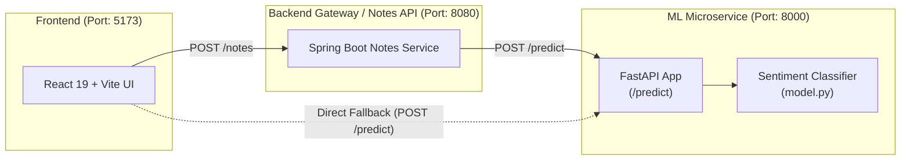

# 🧠 Sentiment Analysis System

[](https://react.dev/)
[](https://vitejs.dev/)
[](https://fastapi.tiangolo.com/)
[](https://www.python.org/)
[](https://opensource.org/licenses/MIT)

A full-stack sentiment analysis application designed for analyzing notes, reviews, and text feedback in real time. The repository consists of a modern **React + Vite** frontend interface and a high-performance **FastAPI** machine learning microservice.

---

## 🏛️ System Architecture



---

## 📁 Repository Structure

```
Sentiment-Analysis/
├── .gitignore               # Root ignore rules for Python, Node, IDEs, and OS files
├── README.md                # Project overview and root documentation
│
├── frontend/                # React (Vite) web client
│   ├── public/              # Static assets and icons
│   ├── src/                 # Application source code
│   │   ├── api.js           # API request layer with configurable endpoint
│   │   ├── App.jsx          # Notes Sentiment Analyzer main UI component
│   │   ├── index.css        # Theme variables and global stylesheet
│   │   └── main.jsx         # React application entry point
│   ├── .gitignore           # Frontend-specific ignore rules
│   ├── package.json         # NPM scripts and dependencies
│   ├── vite.config.js       # Vite configuration
│   └── README.md            # Frontend documentation
│
└── ml-service/              # FastAPI Sentiment ML Microservice
    ├── main.py              # FastAPI app, endpoints, and CORS middleware
    ├── model.py             # Sentiment prediction logic & keyword evaluation
    ├── requirements.txt     # Python dependencies (FastAPI, Uvicorn, Pydantic)
    ├── .gitignore           # Python & virtual environment ignore rules
    └── README.md            # ML Service documentation
```

---

## 🚀 Quick Start Guide

To run the full stack locally, follow these steps to start both the **ML Service** and the **Frontend**:

### 1. Start the ML Service (FastAPI)

```bash
# Navigate to the ML service folder
cd ml-service

# Create and activate a virtual environment
# Windows:
python -m venv .venv
.\.venv\Scripts\Activate.ps1

# Linux / macOS:
python3 -m venv .venv
source .venv/bin/activate

# Install dependencies
pip install -r requirements.txt

# Start the FastAPI server
uvicorn main:app --reload --port 8000
```

- **Health check**: [http://localhost:8000/](http://localhost:8000/)
- **Interactive Swagger Docs**: [http://localhost:8000/docs](http://localhost:8000/docs)
- **ReDoc**: [http://localhost:8000/redoc](http://localhost:8000/redoc)

---

### 2. Start the Frontend (React + Vite)

In a new terminal window:

```bash
# Navigate to the frontend directory
cd frontend

# Install dependencies
npm install

# Start the development server
npm run dev
```

- **Web App**: [http://localhost:5173](http://localhost:5173)

---

## ⚙️ Configuration & Environment Variables

### Frontend Configuration (`frontend/.env`)
By default, the frontend sends note requests to `http://localhost:8080/notes` (matching the companion Spring Boot Notes API).

You can easily redirect it to another URL or directly to the FastAPI service by setting `VITE_API_URL`:

```env
# Point to custom backend
VITE_API_URL=http://localhost:8080/notes

# Or point directly to the ML service
VITE_API_URL=http://localhost:8000/predict
```

---

## 📡 API Reference

### `POST /predict`
Analyzes text input and returns the predicted sentiment.

- **Request Body**:
```json
{
  "text": "The lecture was clear, informative, and really great!"
}
```

- **Response Body**:
```json
{
  "text": "The lecture was clear, informative, and really great!",
  "sentiment": "positive"
}
```

#### Sentiment Categories
| Sentiment | Description | Visual Badge |
|---|---|---|
| `positive` | Positive emotion, satisfaction, praise | 🟢 Green |
| `negative` | Dissatisfaction, complaints, negative sentiment | 🔴 Red |
| `neutral` | Factual statements, objective notes | 🟡 Amber |

---

## 🛠️ Testing & Verification

### Test ML Service via cURL:
```bash
curl -X POST "http://localhost:8000/predict" \
     -H "Content-Type: application/json" \
     -d '{"text": "Everything is running smoothly"}'
```

### Test ML Service via PowerShell:
```powershell
Invoke-RestMethod -Uri "http://localhost:8000/predict" `
                  -Method Post `
                  -ContentType "application/json" `
                  -Body '{"text": "Everything is running smoothly"}'
```

---

## 🤝 Contributing

1. Fork the repository.
2. Create your feature branch (`git checkout -b feature/AmazingFeature`).
3. Commit your changes (`git commit -m 'Add some AmazingFeature'`).
4. Push to the branch (`git push origin feature/AmazingFeature`).
5. Open a Pull Request.

---

## 📄 License

This project is licensed under the MIT License - see the [LICENSE](LICENSE) file for details.
